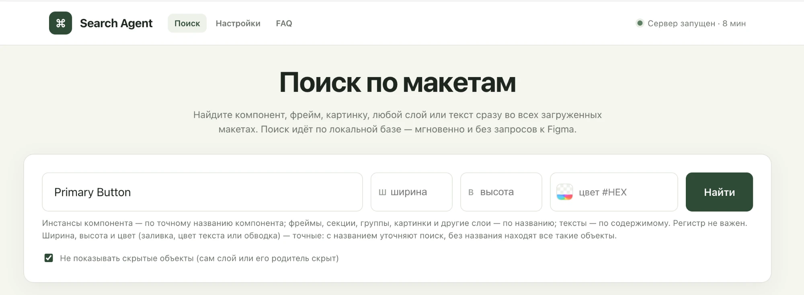

# Search Agent — поиск по макетам Figma



**Найдите любой компонент, слой, текст или цвет сразу во всех ваших макетах Figma — за пару секунд.**

Figma умеет искать только внутри одного открытого файла. Search Agent ищет по всем макетам сразу:
вы добавляете ссылки на файлы, программа один раз загружает их структуру к себе на компьютер,
и дальше поиск работает мгновенно, без ожидания и без запросов к Figma.

Ваши макеты при этом **никак не меняются** — программа их только читает.

---

## Для чего это нужно

Search Agent отвечает на вопросы, на которые в Figma уходят часы:

- **Где используется кнопка Primary Button?** Все её инстансы во всех макетах, даже переименованные,
  спрятанные внутри других компонентов или скрытые.
- **Где розовые кнопки размера B 48px?** Отметьте нужные варианты галочками, как в фильтрах интернет-магазина.
- **Где встречается текст «Купить»?** Все надписи с этим словом.
- **Какие объекты размером 56 × 56?** Например, все иконки или аватарки такого размера.
- **Где используется цвет #FF006F?** Или почти такой же оттенок, с допуском в 10%. Видно и то,
  задан ли цвет стилем, переменной или вручную.

У каждого результата есть кнопка **«Открыть в Figma»**: она открывает нужный слой прямо в приложении Figma.

## Как это устроено

1. **Вы добавляете ссылки на макеты** на странице «Настройки».
2. **Программа загружает их структуру** в небольшую базу у вас на компьютере: названия слоёв,
   компоненты, тексты, размеры, цвета, шрифты. Большой макет загружается за 1–3 минуты, и это нужно
   сделать один раз (потом — только когда макет изменится).
3. **Вы ищете** на главной странице. Поиск идёт по этой базе, поэтому он быстрый и работает
   даже по десяткам макетов сразу.

Всё работает только на вашем компьютере: программа открывается в браузере, но в интернет ваши данные
не отправляет — кроме запросов к самой Figma при загрузке макетов.

---

## Установка

Понадобится Mac, [Python 3.10 или новее](https://www.python.org/downloads/) и личный токен Figma.
Всё делается один раз.

**1. Скачайте проект и установите его.** Откройте «Терминал» и выполните по очереди:

```bash
git clone https://github.com/vadimdesign-hub/search-agent.git
```

```bash
cd search-agent
```

```bash
python3 -m venv .venv && .venv/bin/pip install -r requirements.txt
```

**2. Включите автозапуск** — тогда программу не нужно будет запускать вручную:

```bash
./scripts/install-autostart.sh
```

**3. Откройте в браузере** http://127.0.0.1:8000 — программа запустится сама.

**4. Получите токен Figma.** Это «ключ», по которому программа читает ваши макеты.
В Figma: аватарка → **Settings** → **Security** → **Personal access tokens** → **Generate new token**.
Достаточно права **File content: Read-only**. Скопируйте токен.

**5. Сохраните токен** на странице **Настройки** (http://127.0.0.1:8000/settings), в разделе
«Подключение к Figma». Токен хранится только на вашем компьютере и нигде не показывается.

Готово. Теперь можно добавлять макеты.

> Без автозапуска программу можно запустить вручную командой `.venv/bin/python -m app`
> и держать «Терминал» открытым, пока она нужна.

---

## Как пользоваться

### Добавить макеты

На странице **Настройки**:

1. Скопируйте ссылку на макет в Figma (Share → Copy link) и нажмите **«Вставить из буфера»**.
   Можно дать ссылку на весь файл или только на страницу, секцию или фрейм.
2. Нажмите **↓** в строке макета — он загрузится в базу. Зелёная галочка ✓ значит «загружено».
3. Если макет изменился в Figma, нажмите **«Проверить обновления»**: у изменившихся появится синяя
   кнопка ↻ — нажмите её, чтобы обновить.

Загрузку можно остановить кнопкой **«Остановить»** — в базе останутся прежние данные.

**Какие страницы загружаются.** Из файла берутся только рабочие страницы, а архивные пропускаются.
Правила (по умолчанию — страницы со словами Stage, Local components и Flow) меняются там же, в «Настройках».

### Искать

На главной странице введите в строку поиска:

- **название компонента** — найдутся все его инстансы;
- **название слоя** — найдутся фреймы, группы, картинки и другие слои с таким названием;
- **текст** — найдутся все надписи с ним.

Рядом есть поля **ширины**, **высоты** и **цвета**. С названием они уточняют поиск, а без названия
находят все объекты такого размера или цвета. Нажмите квадратик в поле цвета — откроется палитра
с пипеткой, прозрачностью и допуском по оттенку.

Слева появятся **фильтры**: тип объекта, компонент, страница, цвет, свойства вариантов (Size, Color, State…).
Сверху — вкладки по макетам. Наведите курсор на название результата, чтобы увидеть подробности:
где лежит объект, его размер, цвет, шрифт и другое.

Кнопка копирования у каждой группы результатов копирует весь список со ссылками — удобно, чтобы
вставить в задачу или сообщение.

### Если что-то непонятно

В программе есть раздел **FAQ** (http://127.0.0.1:8000/faq): там описано, какие данные хранятся,
что они означают и как по ним искать, с примерами.

---

## Безопасность

- Токен Figma хранится только в файле `config.json` на вашем компьютере, доступном лишь вашему
  пользователю, и нигде не показывается — ни на страницах, ни в журналах. В git этот файл не попадает.
- Макеты в Figma только читаются, программа ничего в них не меняет.
- Программа работает только на вашем компьютере (адрес 127.0.0.1) и сама выключается,
  когда вы закрываете её страницу.

## Что программа пока не умеет

- Простые фигуры без своего названия («Rectangle 12», «Vector») не сохраняются — их слишком много,
  а искать их по названию бессмысленно.
- Поиск по цвету учитывает только сплошную заливку, без градиентов.
- Названия переменных Figma не видны (Figma отдаёт их только на тарифе Enterprise) — видно лишь,
  что цвет задан переменной.
- Данные актуальны на момент последней загрузки макета.

---

## Для разработчиков

```bash
.venv/bin/pytest -q
```

- `app/` — сервер (FastAPI): загрузка макетов через Figma REST API в SQLite (`db/figma.sqlite`)
  и поиск по базе. Страницы — `app/static/` (Поиск, Настройки, FAQ).
- `scripts/` — автозапуск через launchd: macOS держит порт 8000 и запускает сервер по первому обращению,
  а сервер сам завершается, когда страницы закрыты. Журнал — `~/Library/Logs/search-agent.log`,
  удалить автозапуск — `./scripts/uninstall-autostart.sh`.
- Страницу поиска можно открыть со ссылкой, например
  `http://127.0.0.1:8000/?q=Primary%20Button&prop_Size=B%2048px&prop_Color=Ghost` — поиск запустится
  сразу, нужные фильтры будут отмечены. Параметры: `q`, `w`, `h`, `color`, `tol`, `alpha`, `prop_<свойство>`.
- `archive/` — прежние варианты поиска (через API и через плагин), см. `archive/README.md`.
